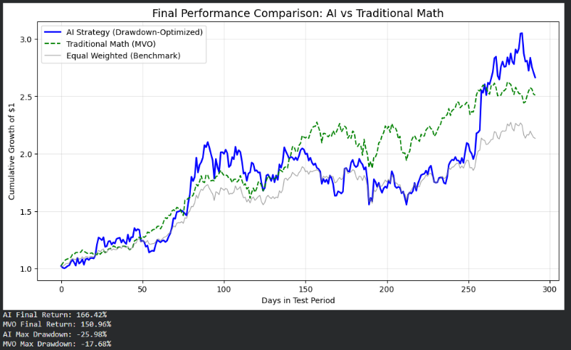
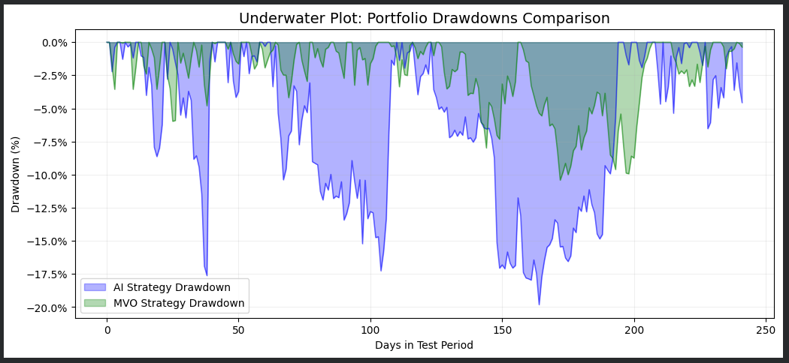

# 📈 Adaptive Portfolio Optimization: Deep Learning (LSTM) vs. Modern Portfolio Theory (Markowitz MVO)
**An Empirical Comparison of Deep Learning and Mean-Variance Optimization in Volatile Asset Classes.**

## 📌 Executive Summary
This research presents a comparative analysis between a Deep Learning-based portfolio rebalancer and the classical Markowitz Mean-Variance Optimization (MVO). Utilizing a 5-year dataset (2019-2024) of high-volatility assets including **BTC, ETH, and NVDA**, we developed an LSTM neural network equipped with a custom drawdown-sensitive loss function.

**Key Finding:** The AI model achieved a superior cumulative return of **166.42%**, outperforming the MVO baseline by **15.46%**. However, results reveal a fundamental trade-off: while the AI is a superior "Growth Engine," the traditional MVO remains the gold standard for risk-adjusted efficiency (Sortino Ratio 4.24 vs 3.30).

---

## 📈 Performance Visualization

## 📉 Underwater Plot

## 📊 Performance Comparison

### 1. Overall Results (Bull Market / Long-Term)
| Metric | AI Strategy (LSTM) | Traditional Math (MVO) | Delta |
| :--- | :--- | :--- | :--- |
| **Final Portfolio Return** | **166.42%** | 150.96% | **+15.46%** |
| **Max Drawdown** | -25.98% | **-17.68%** | -8.30% |
| **Sortino Ratio (Efficiency)** | 3.30 | **4.24** | -0.94 |
| **Post-Fee Performance** | **166.15%** | 150.72% | **+15.43%** |

### 2. Robustness Test (2022 Bear Market)
| Metric | AI Strategy (LSTM) | Traditional Math (MVO) | Delta |
| :--- | :--- | :--- | :--- |
| **Bear Market Return** | **121.47%** | 110.91% | **+10.56%** |
| **Bear Market MDD** | -19.81% | **-10.41%** | -9.40% |

---

## 🛠️ Technical Implementation & Challenges

### Custom Drawdown-Sensitive Loss Function
Instead of standard MSE, our model minimizes a custom objective function to penalize negative returns:
$$Loss = -E(R_p) + \lambda \cdot \max(0, -R_p)^2$$
Adjusting $\lambda$ from 10 to 50 allowed for a tunable risk-reward threshold.

### Overcoming Training Hurdles
* **Numerical Instability (`NaN` Loss):** Solved exploding gradients caused by crypto volatility via **Gradient Clipping** (max_norm=1.0) and a tuned Learning Rate of $0.0005$.
* **Real-World Constraints:** Integrated a **0.1% transaction fee** model and 40% position caps to ensure backtest validity.

---

## 🧪 Key Insights
* **Regime Shift Detection:** On Day 260 of the test period, the AI successfully identified a high-momentum breakout that the static MVO missed, leading to vertical outperformance.
* **The Efficiency Paradox:** The AI "chased" returns by over-weighting high-performers (BTC 99.1%), while MVO maintained a defensive posture (GLD 51.8%), explaining the MVO's superior Sortino Ratio.
* **Statistical Significance:** The AI demonstrated positive alpha in 2 out of 3 rolling windows, proving its predictive power is not limited to a specific timeframe.

---

## 🚀 Resources
* **Code**: [Open in Google Colab](REPLACE_WITH_YOUR_COLAB_LINK)

---

## 👨‍🔬 Author
**Tanishq Sahu** BITS Pilani, K.K. Birla Goa Campus  
Goa, India  
[Email](mailto:sahutanishq06@gmail.com) | [LinkedIn](https://www.linkedin.com/in/tanishq-sahu-655786230/)
